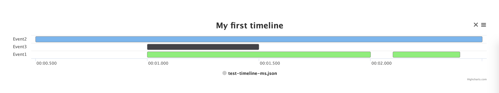

# Timeline

[![Bintray][bintraybadge-svg]][bintray-android-builder]

`Timeline` is a tool for building and viewing time range charts.

# Input and output

`Timeline` uses simple json format for describing time range charts:

```json
// timeline-example.json
{
  "meta": {
    "title": "My first timeline"
  },
  "intervals": [
    {
      "name": "Event1",
      "start": 1000,
      "end": 2000
    },
    {
      "name": "Event2",
      "start": 500,
      "end": 2500
    },
    {
      "name": "Event3",
      "start": 1000,
      "end": 1500
    },
    {
      "name": "Event1",
      "start": 2100,
      "end": 2400
    }
  ]
}
```

Resulting timeline looks so:



## How to use

1. Visit [github.io page](https://acelost.github.io/)
2. Provide your timeline json to page
 * Drop file with timeline on page 
 * Copy timeline json and paste it (Ctrl+V)
 * Pass encoded to base64 timeline json to query parameter `timeline` ([example](https://acelost.github.io?source=aGVsbG8=&timeline=ewogICJtZXRhIjogewogICAgInRpdGxlIjogIk15IGZpcnN0IHRpbWVsaW5lIgogIH0sCiAgImludGVydmFscyI6IFsKICAgIHsKICAgICAgIm5hbWUiOiAiRXZlbnQxIiwKICAgICAgInN0YXJ0IjogMTAwMCwKICAgICAgImVuZCI6IDIwMDAKICAgIH0sCiAgICB7CiAgICAgICJuYW1lIjogIkV2ZW50MiIsCiAgICAgICJzdGFydCI6IDUwMCwKICAgICAgImVuZCI6IDI1MDAKICAgIH0sCiAgICB7CiAgICAgICJuYW1lIjogIkV2ZW50MyIsCiAgICAgICJzdGFydCI6IDEwMDAsCiAgICAgICJlbmQiOiAxNTAwCiAgICB9LAogICAgewogICAgICAibmFtZSI6ICJFdmVudDEiLAogICAgICAic3RhcnQiOiAyMTAwLAogICAgICAiZW5kIjogMjQwMAogICAgfQogIF0KfQ==))

## Builder for Android

Use simple `Timeline` builder in your android application:

```java
public Timeline buildTimeline() {
    Timeline timeline = new Timeline("my first timeline");
    timeline.addInterval(TimelineInterval.builder("i1", TimeUnit.SECONDS).build(0, 1));
    timeline.addInterval(TimelineInterval.builder("i2", TimeUnit.SECONDS).build(1, 4));
    return timeline;
}
```

You can format `Timeline` as json or string:

```java
public void printTimeline(Timeline timeline) {
    JSONObject json = TimelineHelper.toJson(timeline, false);
    Log.i("MyTimeline", json.toString());
}
```

Also you can share `Timeline` with share intent:

```java
public void shareTimeline(Timeline timeline) {
    TimelineHelper.share(
            context, 
            timeline, 
            "timeline_", // file prefix
            "Look at my first timeline!", // message for recipient
            "Choose recipient for your timeline." // title for android system chooser
    );
}
```

For integrating `android timeline builder` just add this dependency to your gradle script:

```groovy
implementation 'com.acelost.timeline:timeline-builder:0.1.0'
```

## Android Transform API

Transform API allows to prepare your timeline for rendering.

1. You can filter intervals in timeline:
```java
public Timeline prepare(Timeline timeline) {
    return timeline.transform()
            .filter(new MyPredicate())
            //.filterMinDuration(1, TimeUnit.SECOND)
            //.filterMaxDuration(10, TimeUnit.SECOND)
            .apply();
}
```

2. You can join intervals with same name:
```java
public Timeline prepare(Timeline timeline) {
    return timeline.transform()
            .join(new MyNamePredicate(), new MyGroupPredicate(), new MyJoinPredicate())
            //.join(10, TimeUnit.MILLISECONDS)
            //.join(10, TimeUnit.MILLISECONDS, "MyInterval")
            .apply();
}
```

3. You can implement custom transformer:
```java
public Timeline prepare(Timeline timeline) {
    return timeline.transform()
            .compose(new MyTransformer())
            .apply();
}
```

## Input json format

```
{
  "meta": {
      "title": <String>, // [Required] Chart title
      "kind": <'ABSOLUTE', 'RELATIVE'>, // [Optional] Chart kind ('ABSOLUTE' by default)
      "units": <'s', 'ms', 'ns'>, // [Optional] Units for time values ('ms' by default)
      "nameKey": <String>, // [Optional] Interval name mapping key ('name' by default)
      "groupKey": <String>, // [Optional] Interval group mapping key ('group' by default)
      "startKey": <String>, // [Optional] Interval start time mapping key ('start' by default)
      "endKey": <String>, // [Optional] Interval end time mapping key ('end' by default)
      "countKey": <String>, // [Optional] Interval count mapping key ('count' by default)
      "payloadKey": <String>, // [Optional] Interval payload mapping key ('payload' by default)
      "valueEncodeRadix": <Int> // [Optional] Radix of timer value encoding (undefined by default)
  },
  "intervals": [
      {
          "<your name key>": <String>, // [Required] Interval name
          "<your group key>": <String>, // [Optional] Interval group
          "<your start key>": <Long/EncodedString>, // [Required] Interval start time
          "<your end key>": <Long/EncodedString>, // [Required] Interval end time
          "<your count key>": <Int>, // [Optional] Interval count
          "<your payload key>": <String> // [Optional] Interval payload
      }, ...
  ],
  "aliases": { // [Optional] Aliases for interval names and groups (using for json compression)
      "<alias-1>": "<interval-name-1>",
      "<alias-2>": "<interval-name-2>",
      ...
  }
}
```

## License

    Copyright 2019 The Spectrum Author

    Licensed under the Apache License, Version 2.0 (the "License");
    you may not use this file except in compliance with the License.
    You may obtain a copy of the License at

       http://www.apache.org/licenses/LICENSE-2.0

    Unless required by applicable law or agreed to in writing, software
    distributed under the License is distributed on an "AS IS" BASIS,
    WITHOUT WARRANTIES OR CONDITIONS OF ANY KIND, either express or implied.
    See the License for the specific language governing permissions and
    limitations under the License.
    
[bintray-android-builder]: https://bintray.com/acelost/Timeline/timeline-builder
[bintraybadge-svg]: https://img.shields.io/bintray/v/acelost/Timeline/timeline-builder.svg
